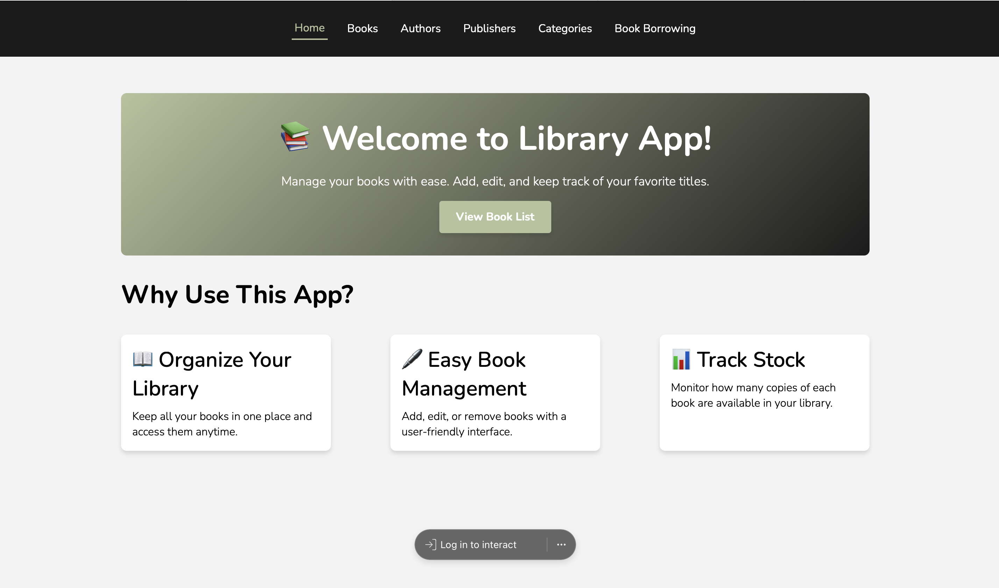

# 📚 Library App

Welcome to the **Library App**! This is a React-based web application that allows users to manage their books with ease. With features like book organization, management, and tracking, it's your go-to app for creating a digital library.

---

## 🌟 Features

- **Organize Your Library**: Keep all your books in one place and access them anytime.
- **Easy Book Management**: Add, edit, or remove books with a user-friendly interface.
- **Track Stock**: Monitor the availability of each book in your library.

---

## 🖥️ Live Demo

[Check out the live demo](https://library-app-two-indol.vercel.app) 🚀

---

## 🛠️ Technologies Used

- **React**: For building the user interface.
- **React Router**: For navigation between pages.
- **axios**: For fetching datas.
- **CSS**: For styling and responsiveness.
- **JavaScript**: For logic and interactions.

---

## 📋 Future Improvements

- Add responsive design for mobile and tablet devices.
- Implement a search feature to quickly find books.
- Integrate user authentication for personalized libraries.

---

## 📄 License

This project is licensed under the MIT License.